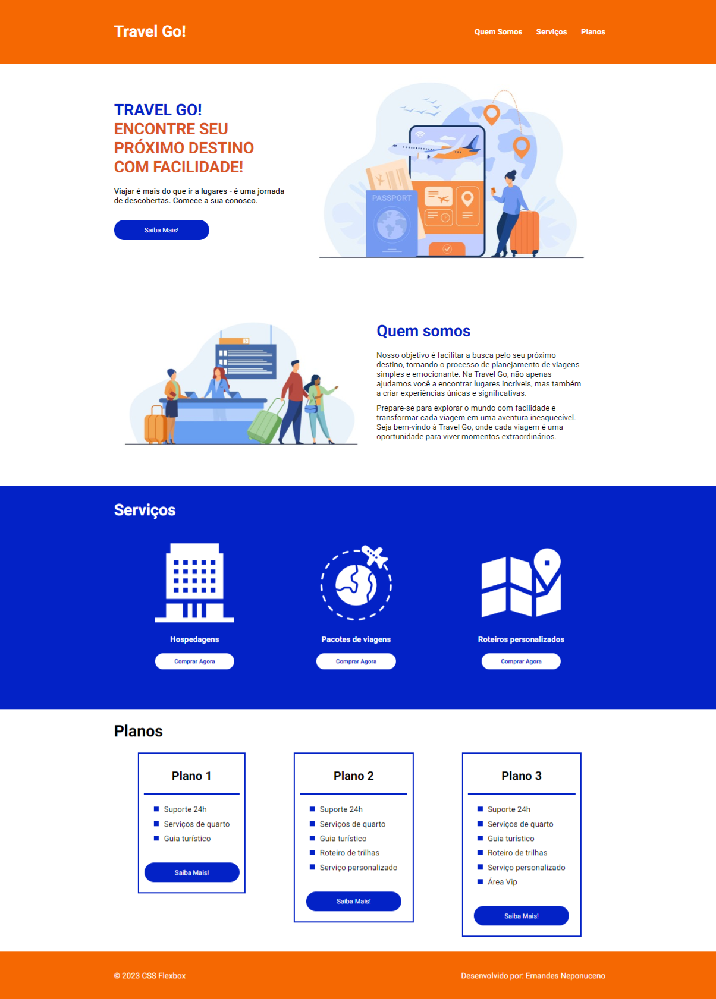

# Posicionando-elementos-com-Flexbox-em-CSS

## 🏋️‍♂️ Desafio de Projeto HTML + CSS: Posicionando elementos com Flexbox em CSS. 

Desafio de projeto proposto para criação de um layout responsivo para um site de viagens.   
Os temas abordados são: 
- Unidades de medidas.
- Estruturação e formatação de texto.
- Conceitos de media query.
- Dimensionamento de imagens.
- Responsividade 

Além de outros recursos.

## 💻 Tecnologias utilizadas nesse projeto:

  
  

## 💻 Preview:
- Veja como ficou o projeto acessando: [o link do Github Pages](https://ernandesneponuceno.github.io/Posicionando-elementos-com-Flexbox-em-CSS/)
  

## 🤔 O que aprendi com esse projeto:
- Aprimorar minhas habilidades em HTML e CSS.
- Utilizar os recursos de responsividade.
- Estilização de textos e boas práticas de design.
- Utilização de unidades de medidas voltadas para responsividade.
- Utilização de atributos do Flex container e Flex items.
- Melhor entendimento sobre display flex. 

## 📌 Créditos
- **Video aulas:** ✨Posicionando elementos com Flexbox em CSS:
  [Curso DIO](https://web.dio.me/course/posicionando-elementos-com-flexbox-em-css/learning/46f1e8c7-ef6e-458e-ad4e-369fc65faba7)
